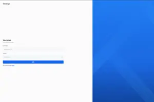
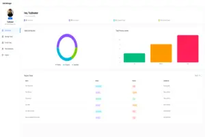
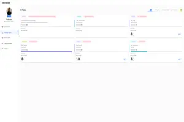

<div align="center"> 

# 📋 MERN Stack Task Manager


</div>

## 📖 Overview

The **MERN Stack Task Manager** is a fully responsive and feature-rich application designed to simplify **task creation, assignment, and tracking** for individuals and teams.  
It offers an intuitive dashboard, real-time progress tracking, automated status updates, and seamless collaboration tools.  
Perfect for both **personal productivity** and **team project management**.

---

## 🚀 Features

- **📊 User Dashboard** – View assigned tasks, track progress, and access task insights.
- **📝 Task Management** – Create, edit, delete tasks with due dates and priorities.
- **⚡ Automated Status Updates** – Tasks auto-update status based on checklist progress.
- **🤝 Team Collaboration** – Assign tasks to multiple users & monitor completion.
- **📌 Priority Tracking** – Categorize tasks by priority and monitor levels.
- **📑 Report Downloads** – Export task data for analysis.
- **📎 Attachment Support** – Add and access task-related files.
- **📱 Mobile Responsive** – Smooth experience on all devices.

---

## 🛠 Tech Stack

| Frontend | Backend | Database | Styling | Others |
|----------|---------|----------|---------|--------|
|  React.js |  Node.js |  MongoDB |  Tailwind CSS |  JWT Auth |
| - |  Express.js | - | - |  Chart.js |

---

## 📂 Folder Structure

```bash
MERN-Stack-Task-Manager/
│── backend/           # Express server, MongoDB models, routes, controllers
│── frontend/          # React.js app with Tailwind CSS
│── package.json       # Project dependencies
│── README.md          # Documentation
```

---

## ⚙️ Installation & Setup

### 1️⃣ Clone Repository

```bash
git clone https://github.com/Sushant98K/MERN-Stack-Task-Manager.git
cd MERN-Stack-Task-Manager
```

### 2️⃣ Setup Backend

```bash
cd backend
npm install
```

Create a `.env` file in `backend/`:

```env
MONGO_URI=your_mongodb_connection_string
JWT_SECRET=your_secret_key
PORT=8000
ADMIN_INVITE_TOKEN=create_admin_invite_code

```bash
Run backend server:

```bash
npm run dev
```

### 3️⃣ Setup Frontend

```bash
cd ../frontend
npm install
npm run dev
```

---

## 📸 Screenshots

| Log-in | Dashboard | Task Management |
|-----------|-----------------|---------|
|  |  |  |

---

## 📡 API Endpoints

### Auth Routes

| Method | Endpoint          | Description         |
|--------|-------------------|---------------------|
| POST   | `/api/auth/login` | Login user          |
| POST   | `/api/auth/signup`| Register new user   |
| GET    | `/api/auth/user`  | Get logged user info|

### Task Routes

| Method | Endpoint                 | Description              |
|--------|--------------------------|--------------------------|
| GET    | `/api/tasks`              | Get all tasks            |
| POST   | `/api/tasks`              | Create new task          |
| PUT    | `/api/tasks/:id`          | Update task              |
| DELETE | `/api/tasks/:id`          | Delete task              |

---

## 📌 Usage

1. Login or register.
2. Create and assign tasks with priorities and due dates.
3. Monitor progress from the dashboard.
4. Download task reports for analysis.

---

## 🤝 Contributing

1. **Fork** the repo
2. Create a **feature branch**: `git checkout -b feature-name`
3. **Commit** changes: `git commit -m 'Add some feature'`
4. **Push** to branch: `git push origin feature-name`
5. Create a **Pull Request**

---

## 📜 License

This project is licensed under the **MIT License** – see the [LICENSE](LICENSE) file for details.

---

## 👨‍💻 Author

**Sushant**  
[](https://github.com/Sushant98K)  
[](https://linkedin.com/in/your-link)  
